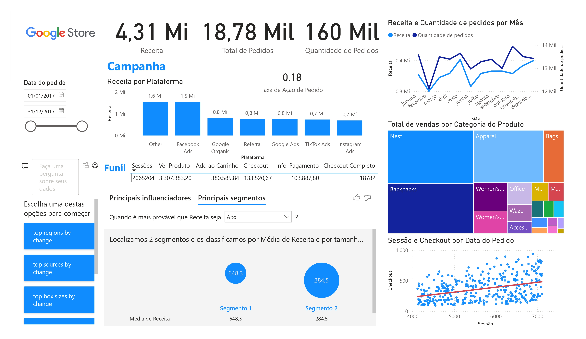

# Loja Google (Google Store)
Este dashboard foi desenvolvido para a análise interativa dos dados de vendas da **Google Store** no ano de 2017, com o intuito de fornecer insights valiosos e facilitar a tomada de decisões estratégicas. A ferramenta utilizada para a criação desse dashboard foi o **Power BI**, proporcionando uma interface visual robusta e prática para os tomadores de decisão. Aqui estão os principais insights e funcionalidades disponíveis.

## Screenshots

### Visão Geral do Dashboard


## Insights Principais

### 1. **Receita Total e Pedidos**
   - **Receita total**: 4,31 Milhões de dólares.
   - **Total de pedidos**: 18,78 Mil pedidos.
   - **Quantidade de itens vendidos**: 160 Mil itens.

### 2. **Desempenho por Plataforma de Anúncios**
   - **Facebook Ads** e **Other** se destacam como as maiores fontes de receita, gerando 1,6 Milhões e 1,5 Milhões de dólares respectivamente.
   - **Google Organic** e **Referral** geram uma receita significativa de 800 mil reais cada, enquanto **Google Ads**, **TikTok Ads** e **Instagram Ads** ficam levemente abaixo de 800 mil reais.
   - Isso sugere que diversificar as campanhas entre várias plataformas resulta em melhor alcance e retorno financeiro.

### 3. **Taxa de Conversão**
   - **Taxa de Ação de Pedido**: 0,18, ou seja, há uma relação de aproximadamente 1 ação para cada 5 pedidos.
   - O funil de conversão mostra que, de 2,06 milhões de sessões, cerca de 18.782 pedidos foram completados, indicando uma oportunidade de otimização na taxa de conversão ao longo do funil.

### 4. **Receita e Quantidade de Pedidos por Mês**
   - A análise de pedidos e receitas mensais destaca **maio** e **dezembro** como os meses de pico para receitas, ambos ultrapassando 13 Mil pedidos.
   - Esses dados são valiosos para planejamento de estoque e alocação de campanhas de marketing em meses específicos com maior demanda.

### 5. **Vendas por Categoria de Produto**
   - **Nest**, **Apparel**, **Backpacks**, e **Women's Apparel** são as categorias com maior volume de vendas.
   - **Nest**, especificamente, lidera com grande vantagem, sendo crucial para focar campanhas nessa categoria para aumentar a lucratividade.

### 6. **Sessões e Checkout por Data de Pedido**
   - A correlação linear entre **sessões** e **checkout** é visualizada, e a tendência positiva sugere que mais visitas ao site resultam em mais checkouts, evidenciando que uma estratégia para aumentar o tráfego pode aumentar diretamente as vendas.

### 7. **Segmentação de Clientes**
   - Dois segmentos de clientes foram identificados:
     - **Segmento 1**: Receita média de 648,3.
     - **Segmento 2**: Receita média de 284,5.
   - Esses dados podem guiar a criação de campanhas de marketing direcionadas para cada segmento, visando aumentar o ticket médio dos clientes do Segmento 2.

## Funcionalidades Interativas
- **Seleção de Datas**: O usuário pode filtrar os dados entre 1º de janeiro de 2017 a 31 de dezembro de 2017 para analisar comportamentos sazonais e tendências mensais.
- **Funil de Conversão**: Interativo para visualizar os diferentes estágios do comportamento dos usuários, desde a sessão no site até o checkout final.
- **Análise de Receita por Plataforma**: Detalhamento de quais plataformas de marketing digital geraram maior receita, permitindo a análise de desempenho e otimização de campanhas.
- **Análise de Vendas por Categoria**: A árvore de categorias ajuda a entender quais produtos estão gerando mais receita, permitindo o ajuste de estoque e foco em produtos com maior demanda.

## Tomada de Decisão Estratégica
Com base nos dados deste dashboard, as seguintes ações são recomendadas:
- **Investir mais em campanhas no Facebook Ads e outras plataformas de alta receita**.
- **Aumentar esforços para otimizar a conversão ao longo do funil**, especialmente na etapa de **add-to-cart** para checkout.
- **Focar campanhas de marketing nos meses de maior demanda**, como maio e dezembro, garantindo que o estoque esteja preparado.
- **Criar campanhas segmentadas** com base nos dados de receita média dos diferentes segmentos de clientes, com o objetivo de aumentar o ticket médio.

---

## Conclusão
Este dashboard oferece uma visualização clara e estratégica dos dados de vendas da Google Store, permitindo que gerentes de marketing e de operações tomem decisões informadas para otimizar a receita, melhorar a experiência do usuário e aumentar a eficiência das campanhas publicitárias.


## Como Executar este Projeto

1. Clone este repositório:
   ```bash
   git clone https://github.com/pedrolporto/google_store.git
Abra o arquivo .pbix no Power BI Desktop para visualizar o relatório e, se necessário, ajustar as conexões de dados.

(Opcional) Carregue novas bases de dados conforme a necessidade da sua análise.

Requisitos para Execução
Power BI Desktop (última versão recomendada)
Acesso às bases de dados financeiras do Google Store (dados fictícios ou anonimizados podem ser usados para teste)

## Autor

- [@pedrolporto](https://www.github.com/pedrolporto)

## Dados

- Dados fornecidos pela DataTechFlorida.
